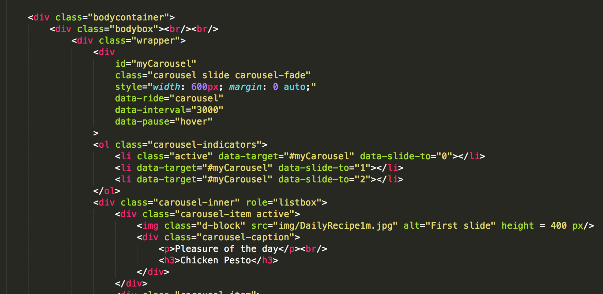
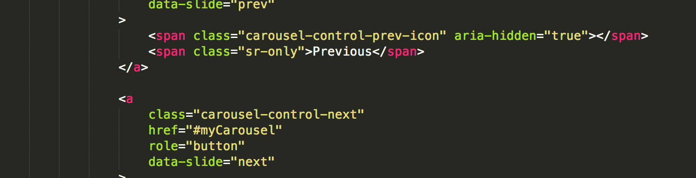
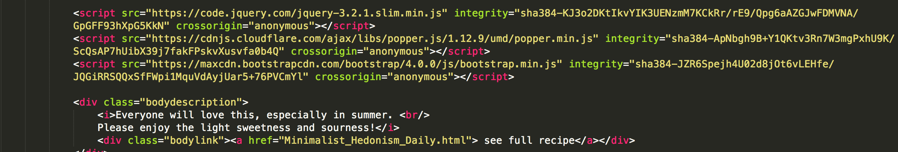
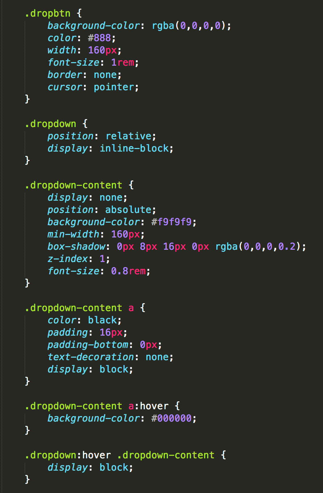
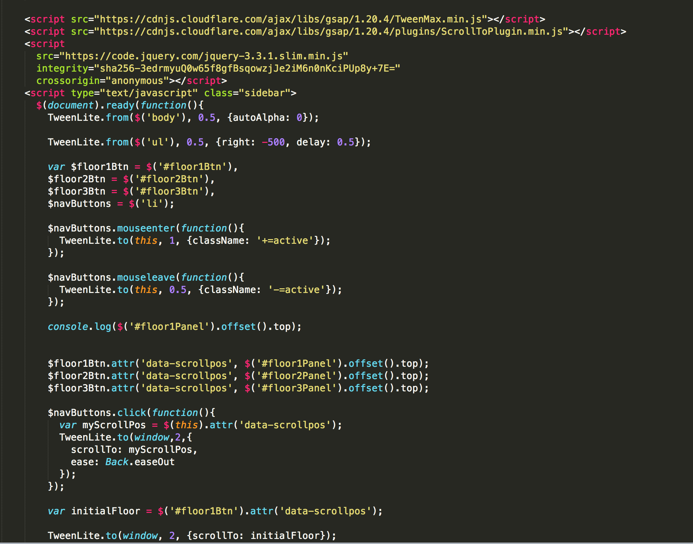

# Ruiqi(Richael) Sun Final Project
[link to my Blog](https://sites.bxmc.poly.edu/~richaelsun/WebDev/)
``` | ```
[link to my Final](https://richaelsun0224.github.io)
``` 
```

## Documentation
1. After learning application of Bootstrap, jQuery and JavaScript in Website Development, I decided to add some features such as image slideshow using bootstrap carousel, dropdown menu and indicators for each section in a webpage using GSAP. I also want to imrpove the UI of my "Daily recipe" page.

2. Boostrap Carousel Slideshow
 
 
 

3. Dropdown Menu
 

4. GSAP_scrollto
 


## Issues I Encountered
### Bootstrap VS. CSS/HTML
- The addition of bootstrap can affect the positioning and style of other content set up in CSS/HTML.
This can be solved by adding more detailed tab to the CSS classes that can be called in HTML.


### Bootstrap again! - Carousel mask
- I want to add masks to my slideshow images so that there will be more contrast between the caption text and the image to make it clearer. I tried the methods of using "carousel-mask" and adding a class "layer" for the mask. However, both did not work.

### $floor1Btn.attr('data-scrollpos', $('#floor1Panel').offset().top)???
- I want to set a distance from the top of the webpage and the position where the headline jumps to. However, I cannot figure out how to set up the offset value from the top.

