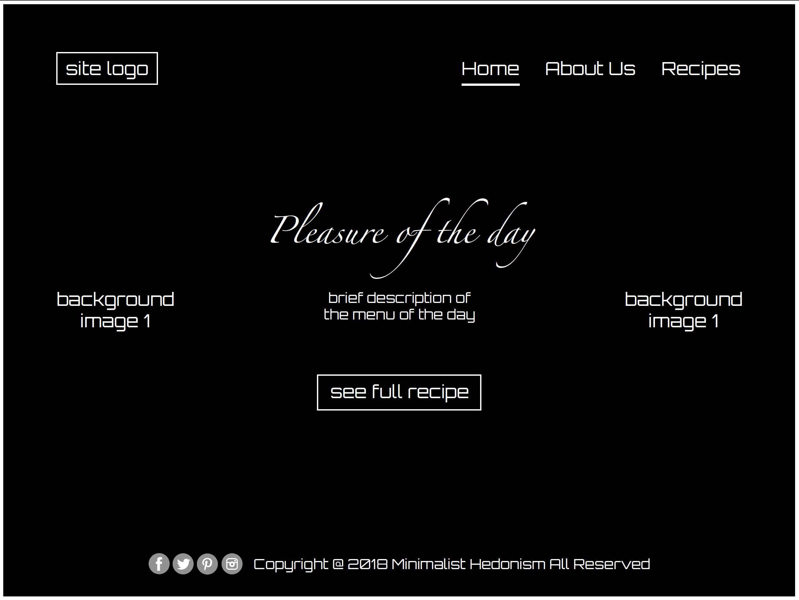
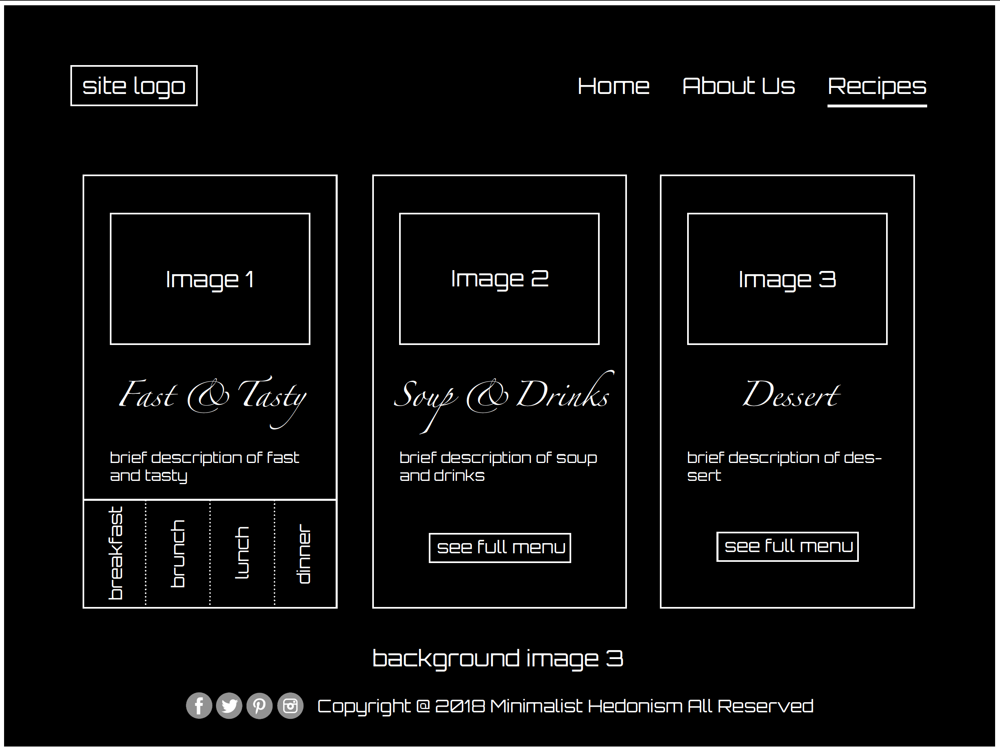

# Ruiqi(Richael) Sun Midterm Project
[link to my Blog](https://sites.bxmc.poly.edu/~richaelsun/WebDev/)
``` | ```
[link to my Midterm](https://richaelsun0224.github.io)
``` 
```

## Documentation
1. I firstly started with the topic that I would like to work on, which is a recipe website. A lot of people nowadays including I myself do not really have sufficient time and feel it troublesome to cook although we love food. However, the problem is that it is both unhealthy and costly to eat outside everyday. It makes me come up with the idea of a website with recipe for fast and tasty food to promote a minimalist hedonistic lifestyle so that we can enjoy delicious cuisines with minimum time spent on cooking.

2. The second step is to work on the sitemap and wireframe of the website, including structure, position, size, style, and etc. of the header, footer and body content for each page. 
 
 
 
 
 

3. Starting with the homepage of the website, I applied the knowledge and skills I learnt during the coding process such as:

### Header & Footer Positioning
 

### Nav Bar & Transition Effects
 

### Text When Mouseover
 

## Finalised Website
[link to Minimalist Hedonism](https://richaelsun0224.github.io)


## Issues I Encountered
* Positioning and layouts of the content boxes
  - I had trouble with choice of type of "position", especially between "relative" and "absolute" since I do not really understand how do they function. I use them wrongly initially when I want to add both images and text into the content boxes so that the boxes are not positioned at where I expected.

* Text When Mouseover
  - The skills work on single image, but when I tried to add more images and arrange them inline, the "hover" effect fails to work until I learnt to use "inline-grid" positioning.

## What To Do Next?
I would like to make use of other languages and functions to add more interactive parts to my website to make the website functions better.
Currently, I use external link to the recipes. I would like to spend more time on creating my own recipe with the style fitting the theme of the website.
 


